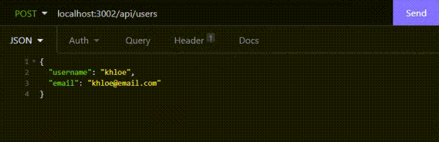
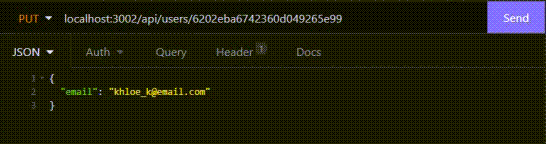
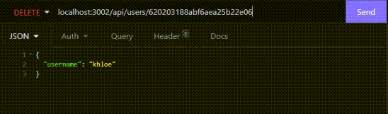
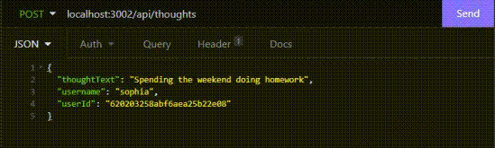
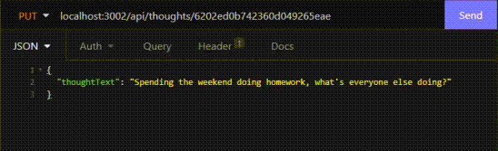
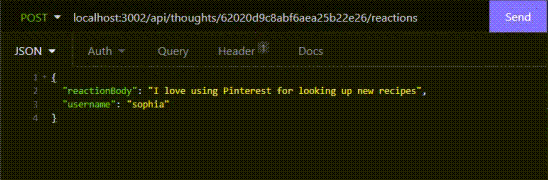
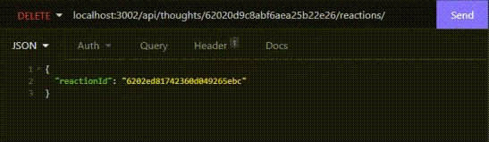

# social-zone
 
  ## Description
  This is an API for a social network web application named social zone. Users can post their thoughts, react to friend's thoughts and add friends to their friends list. I've used Express.js for routing, MongoDB database and Mongoose ODM. In additional I've used a JavaScript date library to format dates and times on the posts. 

  ## Table of Contents
  [Installation](#Installation)  
  [Usage](#Usage)  
  [Contributing](#Contributing)   
  [Testing](#Testing)  
  [Questions](#Questions)  
  [License](#License) 
  
  ## Installation
  1. See Contributing for forking the repo
  2. Once these files are local on your machine
  3. Run 'npm install express mongoose mongoose-validator' in the terminal to install npm to create the necessary dependencies
  
  ## Usage

  1. In VS Code integrated terminal type 'npm start' to connect to the database
  2. Open Insomnia to test routes
  3. Setup GET, GET One, POST, PUT and DELETE routes for the following connections:
        *   http://localhost:3002/api/users
        *   http://localhost:3002/api/thoughts
  4. Setup POST and DELETE routes for the following connections:
        *   Friends:
            *   http://localhost:3002/api/users/\<userId>/friends/\<userId>
        *   Reactions:
            *   http://localhost:3002/api/thoughts/\<thoughtId>/reactions
  5. Test the routes
  6. When satisified with testing, disconnect from server using control + C in the bash terminal

  [Click here to see a walk-thru video of User and Friend Routes](https://watch.screencastify.com/v/Ksudp0m5BxaBtp8Rqd8f)  
  [Click here to see a walk-thru video of Thoughts, Reactions and the Bonus Route](https://watch.screencastify.com/v/Ksudp0m5BxaBtp8Rqd8f)

  ## Contributing  
  
  ### Add to Project  
  To work on or add to this project follow these steps  
  1. Fork the repository  
  2. Add you changes  
  3. Submit a pull request for approval  
  
  ### Issues
  To add issues in GitHub follow these steps
  1. Click on the issues tab
  2. Click 'New issue' button
  3. Give the issue a title and comments
  4. Click 'Submit new issue' button

  [Click here to view current GitHub Issues](https://github.com/kimberlyamaya/social-zone/issues)   

  ## Testing

  ### Test Using Insomnia
  1. Open Insomnia and set up GET, GET One, POST, PUT and DELETE routes to the following connections
  2. Users: http://localhost:3001/api/users
  3. Use JSON in the POST, PUT and DELETE routes, here is an example for each one:
        *   POST route for users  
            
        *   PUT route for users  
            
        *   DELETE route for users  
            
  4. Thoughts: http://localhost:3001/api/thoughts
  5. Use JSON in the POST and PUT routes, here is an example of each one:
        *   POST route for thoughts  
            
        *   PUT route for thoughts  
              
  6. In Insomnia set up POST and DELETE routes to the following connections
  7. Friends: http://localhost:3002/api/users/\<userId>/friends/\<userId>
  8. Reactions: http://localhost:3002/api/thoughts/\<thoughtId>/reactions
  9. Use JSON in the POST and DELETE routes, here is an example of each one:
        *   POST route for reactions  
            
        *   DELETE route for reactions  
              
  10. When a user is deleted and the username is passed in the JSON body then all the user associated thoughts will be deleted as well. 
  11. Test each route by running and view results

  ## Questions

  ### Contact
  For any questions please contact Kimberly Amaya 
  
  Email: [Link to Email](mailto:kimberly_kimbell@yahoo.com)  
  GitHub: [Link to GitHub Account](https://github.com/kimberlyamaya)  
  
  ## License
  This project contains a license from MIT 
  [Click here to see the license](license.md)
   